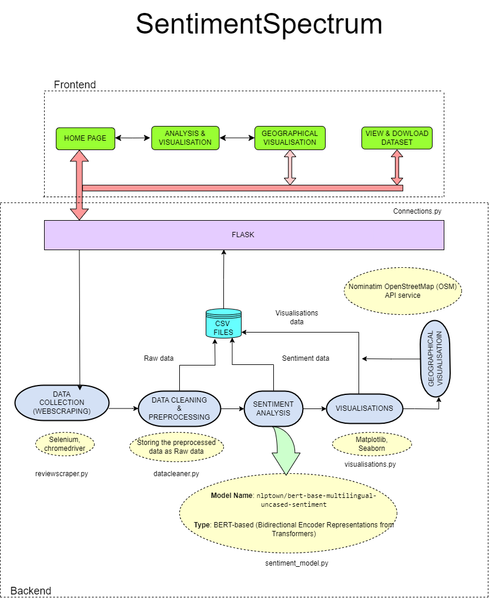

# SentimentSpectrum
## Live Review Sentiment Monitoring And Analysing System

SentimentSpectrum is a web application designed by usiing **Flask framework** to predict customer sentiment for eCommerce websites like Flipkart using a BERT-based pre-trained model. This application offers real-time sentiment analysis with labels such as Positive, Negative, and Neutral, providing valuable insights into customer feedback. The project is built using the **Flask framework** and integrates various tools for data collection, processing, visualization, and machine learning, making it ideal for applications in data science, machine learning (ML), and artificial intelligence (AI).

## Project architecture




## 🚀 Key Features

### Real-Time Data Collection and Processing
- **Tools Used**: Selenium with ChromeDriver
- **Functionality**: Automates the extraction of live customer reviews from Flipkart, ensuring up-to-date sentiment analysis based on real-time data. Data preprocessing steps such as cleaning and normalization prepare raw data for accurate sentiment analysis.

### Dynamic Data Processing
- **Data Handling**: Preprocesses and cleans scraped data to handle inconsistencies, missing values, and formatting issues. This ensures that the data is ready for sentiment analysis with high precision.

### 📊 Advanced Data Visualization
- **Graphical Insights**:
  - **Libraries Used**: Matplotlib and Seaborn
  - **Capabilities**: Users can explore various graphical representations including sentiment distribution charts, trend analyses, and comparison graphs, providing a clear view of customer sentiment trends across products and time.
  
- **Geographical Representation**:
  - **APIs and Libraries**: Nominatim from OpenStreetMap (OSM) and Leaflet
  - **Features**: Interactive geographical visualizations map sentiment data across different locations, providing insights into regional sentiment variations.

## 🧑‍💼 Target Users
- **eCommerce Businesses**: Analyze customer feedback to improve product offerings, identify trends, and enhance customer satisfaction.
- **Data Analysts**: Utilize detailed sentiment analysis and visualizations for market research and business intelligence.
- **Market Researchers**: Explore consumer opinions and behavior patterns within the smartphone market.
- **Product Managers**: Gain actionable feedback to guide product development and marketing strategies.
- **Data Science Enthusiasts**: Apply advanced ML and AI techniques to real-world sentiment analysis scenarios.

## 📥 User-Friendly Experience
- **Interactive Dashboard**: An intuitive interface that guides users through the process of data collection, sentiment analysis, and visualization.
- **Data Accessibility**: Users can view, analyze, and download datasets used for sentiment predictions.
- **Support**: The application includes user guides and tips to help users achieve accurate and meaningful results.

## 🌐 Project Scope
- **Data Collection**: Automates customer review extraction from Flipkart using Selenium for real-time data collection.
- **Sentiment Analysis**: Implements the `nlptown/bert-base-multilingual-uncased-sentiment` model to classify sentiments in reviews.
- **Data Visualization**: Generates graphical representations using Matplotlib and Seaborn, and maps sentiment data across regions using Leaflet.
- **User Interface**: Provides a user-friendly interface for interacting with data, customizing analyses, and viewing results.
- **Data Access**: Users can view, download, and explore datasets used in the analysis.
- **Guidance and Support**: Includes user guides and tips for navigating the application.

## 🛠️ Technologies Used
- **Flask Framework**: For building the web application.
- **Selenium**: For automating the collection of customer reviews.
- **BERT (nlptown/bert-base-multilingual-uncased-sentiment)**: Pre-trained model for sentiment analysis.
- **Matplotlib & Seaborn**: For data visualization.
- **Leaflet & OpenStreetMap**: For geographical visualizations.

## ⚠️ Important Warning

**Please ensure that the ChromeDriver version matches your installed Chrome browser version.** 

If the ChromeDriver is not compatible with your Chrome browser, the web scraping process may fail, resulting in errors or incomplete data retrieval. 

To check your Chrome version, open Chrome and go to `chrome://settings/help`. Then, download the appropriate version of ChromeDriver from the [ChromeDriver download page](https://chromedriver.chromium.org/downloads).

### Important Note:
If you download a new ChromeDriver, you need to manually place the `chromedriver.exe` file in the `chromedriver` directory of your project structure as shown below.

**Note:** All other visualizations and functionalities of the application will work as expected, regardless of the ChromeDriver configuration.


## 📦 Installation & Setup

1. **Clone the repository**:
   ```bash
   git clone https://github.com/augustine-aj/SentimentSpectrum.git
   cd SentimentSpectrum
2. **Install dependencies**:
3. ```bash
   pip install -r requirements.txt
    ```
4. **Run the application**:
  ```bash connections.py ```
5. **Open your browser**:
   Go to `http://localhost:5000/` to access the web application.

## 📥 Data Collection Process
Make sure ChromeDriver is properly installed and configured for Selenium to scrape live reviews. Follow the instructions in the application to collect and process real-time data.

## 📂 SentimentSpectrum Project Directory Structure
```plaintext
SentimentSpectrum/
├── chromedriver/                          # Directory for chromedriver executable
│   └── chromedriver.exe                   # The chromedriver executable for Selenium
│
├── Data/                                   # Directory for data-related files
│   ├── Raw Data/                           # Directory for raw data files
│   │   ├── <Phone_model1 name>/           # Placeholder for specific phone model
│   │   │   └── Camera_Review.csv           # Raw camera review data
│   │   ├── <Phone_model2 name>/           # Another phone model directory
│   │   │   └── Camera_Review.csv           # More raw camera review data
│   │
│   ├── Sentiment Data/                     # Directory for processed sentiment data
│   │   ├── <Phone_model name>/             # Placeholder for specific phone model
│   │   │   └── Sentiment_Camera_Review.csv # Processed sentiment data
│   │   ├── <Phone_model2 name>/           # Another phone model
│   │   │   └── Sentiment_Camera_Review.csv # Processed sentiment data
│   │
│   ├── documents/                          # Directory for project documents
│   │   ├── sentimentspectrum.png           # Project image or logo
│   │   └── SentimentSpectrum_Project_Overview.pdf # Overview document of the project
│
├── frontend/                               # Directory for frontend assets and templates
│   ├── static/                             # Directory for static files (CSS, images, etc.)
│   │   ├── content01bg.jpg                # Background image for content 1
│   │   ├── contentbg.jpg                   # General background image
│   │   ├── endcontentbg.jpg                # Background image for end content
│   │   ├── Spectrum.png                     # Main spectrum image
│   │   └── subcontentbg.jpg                # Background for subcontent
│   │
│   ├── about_project.html                  # HTML page about the project
│   ├── analysis_and_visualisation.html     # HTML page for analysis and visualisation
│   ├── geographical_visualisation.html      # HTML page for geographical visualisation
│   ├── sentiment_analysis_home.html         # Main sentiment analysis interface
│   └── view_csv.html                       # HTML page to view CSV files
│
├── Visualisations/                         # Directory for storing visualisation outputs
│   ├── <Phone_model name>/                 # Placeholder for visualisation related to a specific phone model
│   │   ├── Feature Review/                 # Directory for feature review visualisations
│   │   ├── Geo Data                        # Directory for geographical data visualisations
│   │   ├── Overall Review                  # Directory for overall review visualisations
│   │   └── Review Details                  # Directory for detailed review visualisations
│
├── config.py                               # Configuration file for the project
├── connections.py                          # Main Flask application file
├── datacleaner.py                          # Module for data cleaning processes
├── phone_list.py                           # Script/module to manage phone models
├── requirements.txt                        # List of project dependencies
├── reviewScraper.py                        # Script for scraping reviews from websites
├── sentiment_model.py                      # Module for sentiment analysis model
└── visualisations.py                       # Module for generating visualisations
```

## Overview of Key Files and Directories

- **HTML Files**: These files represent the front-end components of the web application for sentiment analysis and visualization.
  - `about_project.html`: About the project page.
  - `analysis_and_visualisation.html`: Page for analysis and visualizations.
  - `geographical_visualisation.html`: Page for geographical data visualization.
  - `sentiment_analysis_home.html`: Home page for sentiment analysis.

- **Python Scripts**: The backend logic for data handling and sentiment analysis.
  - `config.py`: Configuration settings for the application.
  - `connections.py`: Database or API connection settings.
  - `datacleaner.py`: Data cleaning and preprocessing functions.
  - `phone_list.py`: A list of phones for analysis.
  - `reviewScraper.py`: Script for scraping customer reviews.
  - `sentiment_model.py`: Model for sentiment analysis.
  - `visualisations.py`: Functions for generating visualizations.

- **Data Directories**:
  - **Raw Data**: Contains original raw data files for different phone models.
  - **Sentiment Data**: Contains processed sentiment analysis data for different phone models.

- **Visualisations Directory**: Contains visual outputs of the analysis for different phone models, organized into feature reviews, geographical data, overall reviews, and review details.

## 🎯 Conclusion
SentimentSpectrum is a powerful tool for extracting and analyzing customer sentiments from live eCommerce reviews. With its real-time sentiment predictions, advanced visualizations, and easy-to-use interface, it is an essential resource for businesses and data scientists alike.
